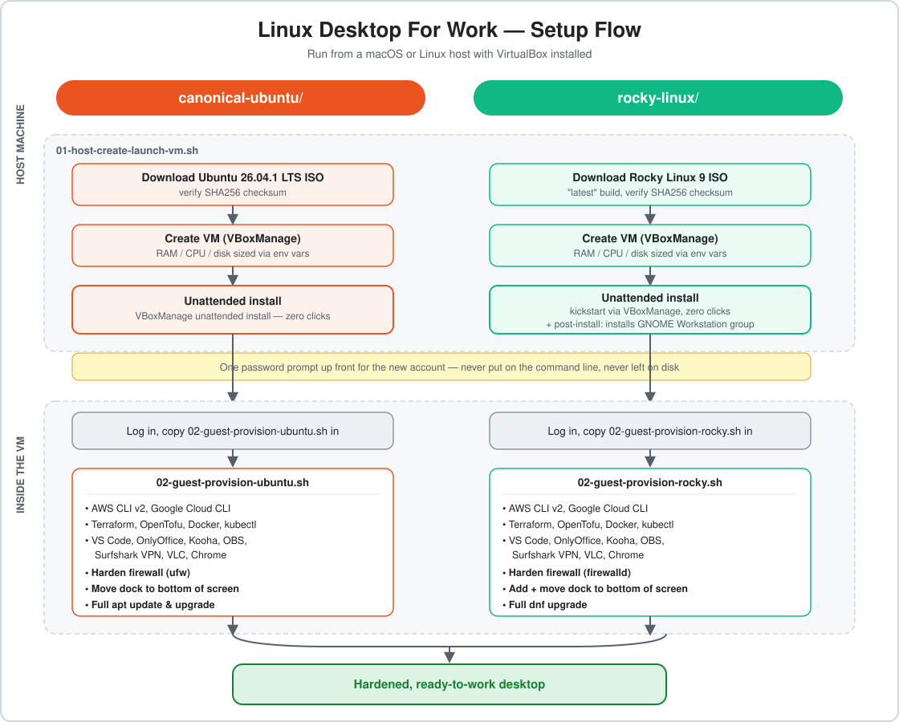

# Linux Desktop For Work

Scripted, repeatable configurations for setting up Linux desktop VMs for work — cloud
CLIs, dev tooling, and hardened defaults, ready to run in VirtualBox (or adapted for
bare metal).

Each distro/environment gets its own top-level directory with its own README covering
what it installs and how to run it.

**Host requirements:** these instructions and scripts are written for a **macOS or
Linux** host — they're plain bash and assume a Unix-style shell and file paths.
Windows isn't covered here.



## Sections

- [`canonical-ubuntu/`](canonical-ubuntu/README.md) — Ubuntu Desktop LTS in VirtualBox,
  provisioned with AWS/GCP CLIs, container & IaC tooling, VS Code, and everyday desktop
  apps, plus firewall hardening and a bottom-docked taskbar.
- [`rocky-linux/`](rocky-linux/README.md) — Rocky Linux Workstation in VirtualBox, with
  the same tooling and hardening as the Ubuntu section, adapted for a `dnf`-based distro.

## Quick start: Ubuntu

1. **Install VirtualBox** on your macOS or Linux host machine if you don't already
   have it: https://www.virtualbox.org/wiki/Downloads (grab the macOS or Linux build
   for your machine — not Windows).
2. **Get this repo** onto your host machine:
   ```bash
   git clone https://github.com/learnlinuxforwork/linux-desktop-for-work.git
   cd linux-desktop-for-work/canonical-ubuntu
   ```
3. **Create and install the VM, unattended:**
   ```bash
   ./01-host-create-launch-vm.sh
   ```
   You'll be asked once for a password for the account it creates. After that it
   downloads Ubuntu, creates the VM, and installs the OS with no further input —
   watch it happen in the VM window. Takes roughly 10-20 minutes.
4. **Log in** to the desktop once it reboots, using the username/password from step 3
   (default username `devops`).
5. **Copy the second script into the VM** — drag-and-drop from the host, or copy/paste
   the file contents through the shared clipboard, into the VM's home folder.
6. **Run the provisioning script inside the VM**, as that same user (not root):
   ```bash
   chmod +x 02-guest-provision-ubuntu.sh
   ./02-guest-provision-ubuntu.sh
   ```
   This installs every app and CLI tool, hardens the firewall, moves the dock to the
   bottom of the screen, and finishes with a full system update.
7. **Reboot the VM** when it's done to pick up the dock change and any updates.

Full details, what gets installed, and troubleshooting: [`canonical-ubuntu/README.md`](canonical-ubuntu/README.md)

## Quick start: Rocky Linux

1. **Install VirtualBox** on your macOS or Linux host machine if you don't already
   have it: https://www.virtualbox.org/wiki/Downloads (grab the macOS or Linux build
   for your machine — not Windows).
2. **Get this repo** onto your host machine:
   ```bash
   git clone https://github.com/learnlinuxforwork/linux-desktop-for-work.git
   cd linux-desktop-for-work/rocky-linux
   ```
3. **Create and install the VM, unattended:**
   ```bash
   ./01-host-create-launch-vm.sh
   ```
   You'll be asked once for a password for the account it creates. After that it
   downloads Rocky Linux, creates the VM, and installs the OS with no further input —
   watch it happen in the VM window. Takes roughly 20-30+ minutes (a bit longer than
   Ubuntu, since it also installs the GNOME desktop group as part of the install).
4. **Log in** to the desktop once it reboots, using the username/password from step 3
   (default username `devops`). If you land on a text login instead of a desktop, see
   the fallback commands in [`rocky-linux/README.md`](rocky-linux/README.md).
5. **Copy the second script into the VM** — drag-and-drop from the host, or copy/paste
   the file contents through the shared clipboard, into the VM's home folder.
6. **Run the provisioning script inside the VM**, as that same user (not root):
   ```bash
   chmod +x 02-guest-provision-rocky.sh
   ./02-guest-provision-rocky.sh
   ```
   This installs every app and CLI tool, hardens the firewall, adds and moves the dock
   to the bottom of the screen, and finishes with a full system update.
7. **Reboot the VM** when it's done to pick up the dock change and any updates.

Full details, what gets installed, and troubleshooting: [`rocky-linux/README.md`](rocky-linux/README.md)

## Conventions

- Scripts are safe to run more than once — re-running after an interruption, or to pick up new tools, won't break anything.
- Host-side steps (creating/booting a VM) and guest-side steps (provisioning the OS
  inside it) are kept in separate scripts, since they run in different places.
- Nothing is installed beyond what's documented in each section's README — no bundled
  extras.
- Always target the current LTS (Ubuntu) or current major release (Rocky) — never an
  interim/non-LTS release. When a new one ships, bump the version at the top of the
  relevant host script instead of leaving an old one pinned.
- VM installs are fully unattended via `VBoxManage unattended install` — no clicking
  through an installer. See each section's README for the exact steps.
